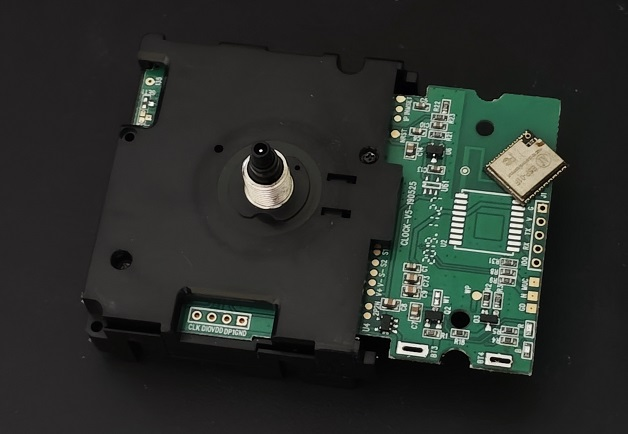

# ESP8266 WiFi Clock Movement Mod

Firmware for generic "WiFi clock movement" with DST support,
powered by [ESPZWApplianceT2](https://github.com/Adam5Wu/ESPZWApplianceT2).



## Backstory

Several years ago I bought a couple of generic "WiFi clock movement" parts, to swap
out the movement core of older quartz clocks.

These clock movement parts are actually controlled by ESP8266 (ESP8285, to be exact),
and supposedly syncs the time with NTP once a day, thereby keeping the time accurate.
And they delivered what they've promised.

However, I cannot help but notice an inconvenience -- no automatic daylight-saving
adjustment. While for "non-smart" clocks manual adjustment is mandatory, still needing
manual interventions twice a year on a "smart" clock is rather unsatisfactory.

So I decided to try creating my own firmware, adding automatic DST support.

## Protocol

Turns out, these parts works **a lot** simpler than I expected. (Well, what
to expect from a $10 device? :P)

The clock control consists of two autonomous parts: ESP-01F and "base clock".
The ESP module takes care of WiFi connection and NTP sync, while the
"base clock" handles the mechanical movements and power control.

1. When powered on, the "base clock" will reset the pointers to `00:00:00`, and
   concurrently powers on the ESP-01F module; it monitors the serial output
   (TXD0) of the module at the baud-rate of 115200.
2. The ESP-01F module will connect to the WiFi network, and sync time with NTP.
   When the time is synced, it will print in the following format:
   ```
   +TIME:Sat May 31 12:44:02 2025 -0400 21:00
   ```
   - `+TIME:` is the preamble for the "base clock" (the ESP module prints
     many debug data, which the "base clock" will ignore);
   - `Sat May 31 12:44:02 2025 -0400` is simply the `strftime()` output using
     pattern `%c %z`;
   - `21:00` has an **unknown** purpose. I *theorize* it could be denoting the
     upcoming time the "base clock" should re-power the ESP module to sync time
     again. However, it seems the "base clock" always re-sync at 9:00.
   - The last two tokens are not strictly required. The "base clock" will happily
     accept `+TIME:Sat May 31 12:44:02 2025`.
3. The "base clock" will keep the ESP module powered on, while blinking the red
   LED, until it received time string like the above on the serial line (or
   timed out, which is about 60 seconds).

   Once time string is received, the "base clock" starts its internal time
   tracking, and powers off the ESP module to conserve energy (blinks the blue
   LED a couple of times as a visual indicator);
4. When the pointers have completed their reset to `00:00:00`, if the "base
   clock" have succeed receiving time from the ESP module, it proceeds to spin
   the pointers to match its internal time.

Additional note:

1. The "base clock" also runs a daily "power saving" (or rather, "coma" :P)
   schedule: between `00:00:00` and `06:00:00`, it will stop sweeping the second
   pointer **and** refuse to power up the ESP module (even via pressing the "set"
   and "reset" button!).
2. The "base clock" seems to *always* re-power the ESP module at 9:00 daily to
   re-sync time. And that means if the DST adjustment does not happen at exactly
   that time (which unfortunately is the case for almost all regions), the clock
   will be unable to timely adjust to the change.

   So please bear with an incorrect time the first morning of every DST change.
4. "Set" button triggered ESP module power-on has a shorter timeout, around 30 sec.
   It is barely enough to perform an OTA update, and is **not** enough for updating
   the system partition at the same time -- bear that in mind, and ensure you new
   versions' frontend and backend can be flashed at different boot times. (Otherwise
   you may need to physically reconnect the ESP module to regain Web access!)

## Features

-  All [base appliance features](https://github.com/Adam5Wu/ESPZWApplianceT2), e.g.:
   -  WiFi provisioning
   -  NTP time syncing
   -  Web-based timezone config with DST
-  Applying a constant time offset to the NTP synced time, for those who want to run
   their clock "accurately inaccurate". :P

To do:
-  Time-based illumination for clocks fitted with
   [WS2812 strip](https://github.com/Adam5Wu/ESPWS2812FBLess).
   -  Of course, this will require the clock to be run on wall-power, and bypass the
      "base clock" power management. It can be easily done by feeding power from the
      ESP module side pin, as opposed to from the better connector port.

## Caveats

The current version is configured for 4MB flash modules, which require de-soldering the
original ESP8285 and wiring an external ESP module.

The ESP8285 has only 1MB built-in flash, which the current version won't fit. I think with
some tweaking (e.g. disabling dual image, OTA support, adjusting various partition sizes
and locations, etc.) one can create a version that fits in the limit.

But I enjoy the convenience and extensibility of the larger flash memory. Since you *only*
need to connect **three** pins: Ground, VCC (3.3v), and TXD0, you can use any ESP8266 module,
even ESP-01s, which is available for under $1 each!